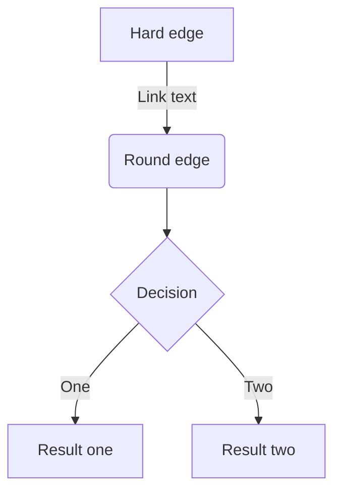

# Zenn Markdown記法一覧

このページでは Zenn のmarkdown記法を一覧で紹介します。

## 見出し
```md
# 見出し1
## 見出し2
### 見出し3
#### 見出し4
```

> [!TIP]
> アクセシビリティの観点から見出し2から始めることをおすすめします

## リスト
```md
- Hello!
- Hola!
  - Bonjour!
  * Hi!
```

- Hello!
- Hola!
  - Bonjour!
  - Hi!

リストのアイテムには`*`もしくは`-`を使います。

## 番号付きリスト
```md
1. First
2. Second
```

1. First
2. Second

## テキストリンク
```md
[アンカーテキスト](リンクのURL)
```

[アンカーテキスト](リンクのURL)

Markdownエディタでは、テキストを範囲選択した状態でURLをペーストすることで選択範囲がリンクになります。

## 画像
```md

```

### 画像の横幅を指定する
画像の表示が大きすぎる場合は、URL の後に半角スペースを空けて`=○○x`と記述すると、画像の幅を px 単位で指定できます。

```md

```

### Altテキストを指定する
```md

```

### キャプションをつける
画像のすぐ下の行に`*`で挟んだテキストを配置すると、キャプションのような見た目で表示されます。

```md

*キャプション*
```

### 画像にリンクを貼る
以下のようにすることで画像に対してリンクを貼ることもできます。

```md
[](リンクのURL)
```

## テーブル
```md
| Head | Head | Head |
| ---- | ---- | ---- |
| Text | Text | Text |
| Text | Text | Text |
```

| Head | Head | Head |
| ---- | ---- | ---- |
| Text | Text | Text |
| Text | Text | Text |

## コードブロック
コードは「\`\`\`」で挟むことでブロックとして挿入できます。以下のように言語を指定するとコードへ装飾（シンタックスハイライト）が適用されます。

\`\`\`js
const great = () => {
  console.log("Awesome");
};
\`\`\`

シンタックスハイライトには Prism.js を使用しています。

### ファイル名を表示する
言語:ファイル名と:区切りで記載することで、ファイル名がコードブロックの上部に表示されるようになります。

\`\`\`js:ファイル名
const great = () => {
  console.log("Awesome")
}
\`\`\`

### diff のシンタックスハイライト
diffと言語のハイライトを同時に適用するには、以下のようにdiffと言語名を半角スペース区切りで指定します。

\`\`\`diff js
@@ -4,6 +4,5 @@
    const foo = bar.baz([1, 2, 3]) + 1;
    let foo = bar.baz([1, 2, 3]);
\`\`\`

なお、diffの使用時には、先頭に+、-、>、<、半角スペースのいずれが入っていない行はハイライトされません。

同時にファイル名を指定することも可能です。

\`\`\`diff js:ファイル名
@@ -4,6 +4,5 @@
    const foo = bar.baz([1, 2, 3]) + 1;
    let foo = bar.baz([1, 2, 3]);
\`\`\`

## 数式
Zenn ではKaTeXによる数式表示に対応しています。

### 数式のブロックを挿入する
`$$`で記述を挟むことで、数式のブロックが挿入されます。

```md
$$
e^{i\theta} = \cos\theta + i\sin\theta
$$
```

> [!WARNING]
> `$$`の前後は空の行でないと正しく埋め込まれないことがあります。

### インラインで数式を挿入する
`$a\ne0$`というように`$`ひとつで挟むことで、インラインで数式を含めることができます。

## 引用
```md
> 引用文
> 引用文
```

> 引用文
> 引用文

## 脚注
脚注を指定するとページ下部にその内容が表示されます。

```md
脚注の例[^1]です。インライン^[脚注の内容その2]で書くこともできます。

[^1]: 脚注の内容その1
```

## 区切り線
```md
-----
```

## インラインスタイル
```md
*イタリック*
**太字**
~~打ち消し線~~
インラインで`code`を挿入する
```

## インラインのコメント
自分用のメモをしたいときは HTML のコメント記法を使用できます。

```html
<!-- TODO: ◯◯について追記する -->
```

この形式で書いたコメントは公開されたページ上では表示されません。ただし、複数行のコメントには対応していないのでご注意ください。

## Zenn 独自の記法

### メッセージ
```md
:::message
メッセージをここに
:::
```

```md
:::message alert
警告メッセージをここに
:::
```

### アコーディオン（トグル）
```md
:::details タイトル
表示したい内容
:::
```

#### 要素をネストさせるには
外側の要素の開始/終了に `:` を追加します。

```md
::::details タイトル
:::message
ネストされた要素
:::
::::
```

### コンテンツの埋め込み

#### リンクカード
```md
# URLだけの行
https://zenn.dev/zenn/articles/markdown-guide
```

また `@[card](URL)` という書き方でカード型のリンクを貼ることもできます。

#### X（Twitter）のポスト（ツイート）
```md
# ポストのURLだけの行（前後に改行が必要です）
https://twitter.com/jack/status/20

# x.comドメインの場合
https://x.com/jack/status/20
```

#### YouTube
```md
# YouTubeのURLだけの行（前後に改行が必要です）
https://www.youtube.com/watch?v=WRVsOCh907o
```

#### GitHub
GitHub上のファイルへのURLまたはパーマリンクだけの行を作成すると、その部分にGitHubの埋め込みが表示されます。

```md
# GitHubのファイルURLまたはパーマリンクだけの行（前後に改行が必要です）
https://github.com/octocat/Hello-World/blob/master/README
```

##### 行の指定
```md
# コードの開始行と終了行を指定
https://github.com/octocat/Spoon-Knife/blob/main/README.md#L1-L3

# コードの開始行のみ指定
https://github.com/octocat/Spoon-Knife/blob/main/README.md#L3
```

> [!NOTE]
> 埋め込めるファイルは、ソースコードなどのテキストファイルのみとなっています。

#### GitHub Gist
```md
@[gist](GistのページURL)
```

特定のファイルだけ埋め込みたい場合:
```md
@[gist](https://gist.github.com/foo/bar?file=example.json)
```

#### CodePen
```md
@[codepen](ページのURL)
```

#### SlideShare
```md
@[slideshare](スライドのkey)
```

#### SpeakerDeck
```md
@[speakerdeck](スライドのID)
```

#### Docswell
```md
@[docswell](スライドのURL)
# もしくは
@[docswell](埋め込み用のURL)
```

#### JSFiddle
```md
@[jsfiddle](ページのURL)
```

#### CodeSandbox
```md
@[codesandbox](embed用のURL)
```

#### StackBlitz
```md
@[stackblitz](embed用のURL)
```

#### Figma
```md
@[figma](ファイルまたはプロトタイプのURL)
```

### その他の埋め込み可能なコンテンツ

#### blueprintUE
```md
@[blueprintue](ページのURL)
```

#### ダイアグラム (Mermaid.js)


> [!WARNING]
> セキュリティ観点からクリックイベントは無効化されています。
> ブロックあたりの文字数は2000文字以内です。
> チェーン数（`&`）は10以下に制限されています。

## 入力補完

### 絵文字（Emoji）
`:`に続いて任意の1文字を入力すると、絵文字の候補が表示されます。
