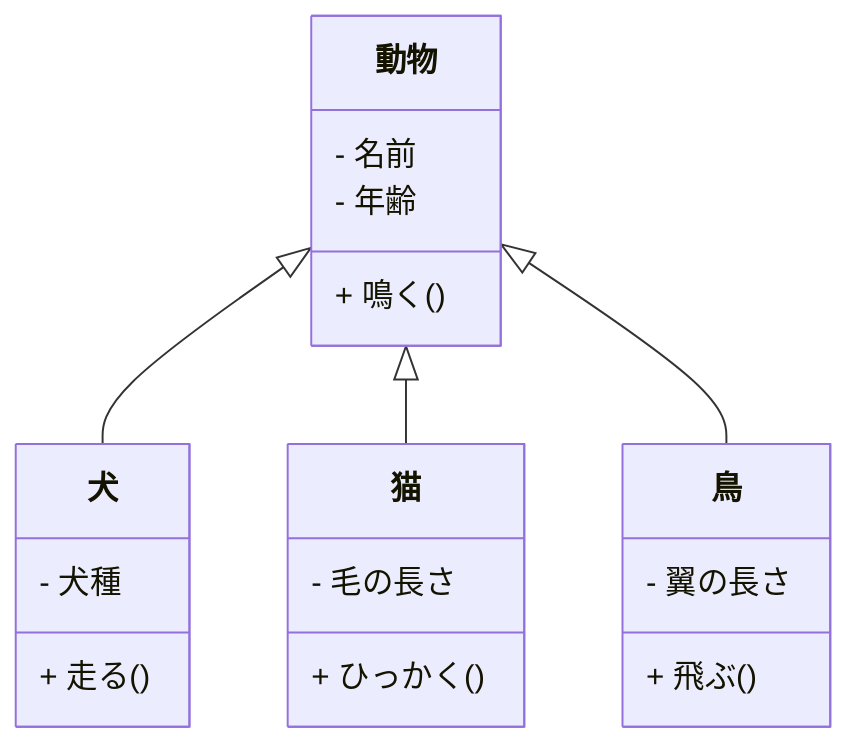
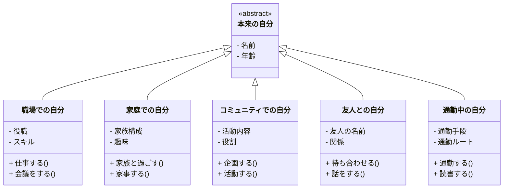

職場や学校で失敗して「なんて自分はダメなんだ」と自分を全否定してしまうことはありませんか？

私もその経験があります。特に20代後半から30代前半にかけて、仕事や日常生活での失敗を、自分の全てが悪いかのように捉え、将来を悲観し、漠然とした不安を抱えていたことをよく覚えています。

しかし、30代後半からは社内外の勉強会やコミュニティ活動に参加するようになり、心に余裕を持てるようになりました。漠然とした不安も、以前と比べて随分と減りました。

## メタ思考とエイリアスで心を守る方法

職場や家庭以外のコミュニティに参加することで心に余裕が持てることは、感覚的には理解できましたが、うまく言語化できず、どこか腑に落ちない部分がありました。

そんな時に出会ったのが、澤円さんの著書『メタ思考～「頭のいい人」の思考法を身につける』です。


この本の中で、「複数の自分を使い分ける」という考え方が、エイリアス（＝別名、リンク）を用いて説明されていました。

:::details 参考：技術的なエイリアスの意味（クリックで開く）
技術的に**エイリアス**は、「別名」や「リンク」という意味で、特定のコマンドやファイル、オブジェクトに対して別名を付けることで、操作を簡略化したり、アクセスを容易にするために使われます。

```text:コマンドを短くするエイリアス
alias ll='ls -la'
alias gs='git status'
```

この場合、`ls -la`に`ll`という別名を与えています。
:::

以下に、書籍からの一部を引用します。

> たとえば、会社にいるときの自分は、自分の名前をまとったエイリアスとして、「私の一部の機能を提供しているに過ぎない」と考えればいいのです。そうすると、かなり気持ちがラクになりませんか？**会社にいる自分や、仕事をしている自分を、自分の人生とイコールにする必要はまったくありません。**

> あくまでもエイリアスなのだから、**ある領域でろくでもない評価を受けたとしても、別に自分自身が棄損するわけではない**。エイリアスとして振る舞えば、自分をいたずらに傷つけずに、もっと自由に生きていけるというわけです。

この内容は、これまでの私のモヤモヤをスッと取り去ってくれました。職場や家庭、コミュニティなどで**複数の役割や機能を持つこと**は、ある場面での取り組みを**自分の人生とイコールにしてしまうリスクを低減**します。それが、心に余裕を持てるようになった理由だと思います。
さらに、自分とエイリアスの関係を理解できるようになり、気持ちがラクになりました。万が一**ある1つのエイリアスが失敗**したとしても、それはあくまでも**役割や機能であって、自分そのものではない**のです。本来の自分を傷つけ消耗する必要はありません。
以下に、「自分」を文脈にしたエイリアスのイメージ図を示します。


*エイリアスのイメージ図*

エイリアスという考え方を取り入れることで、心を守ることができるのではないでしょうか。ここでは書籍の一部を抜粋しましたが、書籍にはさらに多くの魅力があります。ぜひ読んでみてください（[「メタ思考」Amazonへのリンク](https://amzn.asia/d/3XDrNj8)）。

## オブジェクト指向で心を守る方法

澤円さんのエイリアスを使って心を守る方法を示しましたが、さらに技術的な要素と組み合わせて「心を守る方法」がないかを考えてみました。その中で出てきたのが**オブジェクト指向**を用いた方法です。なお、ここからは私の考えになります。

:::details 参考：オブジェクト指向のクラス継承（クリックで開く）
**クラス継承**とは、あるクラス（親クラスまたは基底クラス）の特性や機能を、別のクラス（子クラスまたは派生クラス）が引き継ぐ仕組みです。
  
例えば、動物を表す「動物クラス」があるとし、このクラスには「名前」や「年齢」「鳴く」といった動物共通の特性があります。そして、「犬クラス」を作成するとき、動物クラスを継承することで、犬クラスは動物共通の特性である「名前」や「年齢」「鳴く」といった特徴や機能を引き継ぐことができます。加えて、犬に特有の「犬種」や「走る」といった特性や機能を追加することができます。
  
以下に、UMLのクラス図でその関係を示します。


:::

まず、「本来の自分」クラスを基底クラスとします。この「本来の自分」クラスは抽象（abstract）クラスとしました。というのも、本来の自分というのは、未だに私自身もよく分かっておらず、コンテキスト（背景や環境）にかなり依存すると思ったからです。

次に、「本来の自分」クラスを継承した「職場」や「家庭」「コミュニティ」など、コンテキストに応じた派生クラスを用意します。これらのクラスの関係は、UMLのクラス図で示すと次の通りです。



クラスが用意できたら、実際に職場で仕事をしたり、家で家事をするのは、そのクラスから生成されるインスタンス（実体）です。この考え方でも、エイリアスの時と同様に、職場やコミュニティで失敗をしたとしても、インスタンスを破棄することで本来の自分を傷つけることなく、心を守ることができます。また、クラスは再利用可能ですから、別の職場やコミュニティになったとしても、それぞれのクラスからインスタンス（実体）を再び生成することで活動が可能となります。

## まとめ

特定の環境やシーンにおける自分を、自分の人生とイコールにする必要はありません。また、仮に失敗しても自分を傷つけることなく、心を守る方法をエイリアスやオブジェクト指向を用いて説明しました。一方で、エイリアスやクラスから生成されるインスタンスを大切に扱うことも重要です。安易にエイリアスのリンクを切ったり、インスタンスを破棄したりすることは、ネガティブな結果を生む可能性があります。どうしてもというときや、ここぞというときに、心を守るために行うのが良いと思います。

この記事が、少しでも読者の方々のためになればと思います。最後まで読んでいただき、ありがとうございました。

## 付録（おまけ）

今回の記事では、Mermaid（マーメイド）というテキストベースのダイアグラム作成ツールを用いて図を作成しました。興味のある方は、ぜひご覧ください。

**Mermaid**（マーメイド）は、テキストベースのダイアグラム作成ツールです。この記事で作成したクラス図をはじめ、シーケンスやステートマシン、ガントチャートなど、さまざまな種類の図を作成することができます。また、ZennブログやGitHubのMarkdownに書き込むと、Web上に直接レンダリングすることも可能です。

- 参考リンク①：[**Mermaid User Guide**](https://mermaid.js.org/intro/getting-started.html)
  公式サイトです。左側メニューの「Diagram Syntax」に各図の文法が記載されています。英語サイトなので、必要に応じて機械翻訳してください。

- 参考リンク②：[**VSCodeでMermaidを扱う為の便利な拡張機能あれこれ**](https://qiita.com/sato_kana/items/2a13f19017576488f017)
  VSCodeでMermaidを利用するための拡張機能の解説がされています。

**●記述方法**
Markdownに次のようにテキストで記載します。文法は参考リンク①の公式サイトを参照ください。

    ```mermaid
    classDiagram
        class 動物 {
            - 名前
            - 年齢
            + 鳴く()
        }

        class 犬 {
            - 犬種
            + 走る()
        }

        class 猫 {
            - 毛の長さ
            + ひっかく()
        }

        class 鳥 {
            - 翼の長さ
            + 飛ぶ()
        }

        動物 <|-- 犬
        動物 <|-- 猫
        動物 <|-- 鳥
    ```
&emsp;
**●プレビュー表示**
拡張機能を入れるとVSCodeエディタ上でプレビュー表示できます。必要な拡張機能については、参考リンク②の記事を参照ください。

拡張機能をインストールすると、普段Markdownプレビューするときと同じように、図を確認することができます。

*Mermaidのプレビュー表示（VSCode）*
&emsp;
Zennブログは公式にMermaidをサポートしており、Markdownに書き込むとWeb上でレンダリングされます。

*Mermaidのプレビュー表示（Zennブログ）*

&emsp;
**●AIとの相性の良さ**
テキストベースですので、AIとの相性も大変良いです。この図は、GitHub Copilotを使用して生成しました。指示をより細かく、明確にすることで、思い通りの図が作成できます。AIでベースとなる図を作成し、そこから自身でAIを使いながら追加、修正していくと良いです。

*AIでシーケンス生成（GitHub Copilot）*

ちょっとシーケンスやフローチャートを書きたいけれど、無料で使いやすいツールが無いな～というときに便利ですので、ぜひ使ってみてください。

## 更新履歴

- **2024/10/08**
  折りたたみ表示していた、付録の部分を通常の表示にしました。
