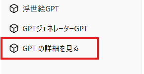
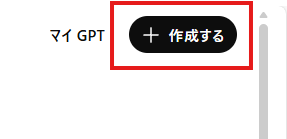

以前、私のブログで、Geminiのカスタム機能である「Gemを作るGem」や、ChatGPTの「GPTを作るGPT」について解説しました。

@[card](https://zenn.dev/safubuki/articles/turtle-20250507-gem2gem)
@[card](https://zenn.dev/safubuki/articles/turtle-20251224-gpt2gpt)

AIのカスタマイズ機能を利用して、AIを作るためのAIを構築する……この「メタ生成」のアイデアはとても便利です。
そして昨今、Anthropicの「Claude Code」によって提唱・規格化され、GitHub Copilotなどの最新AIツールにも採用されているカスタム指示の仕組みが広がっています。それが「**Agent Skills**」です。

Agent SkillsはこれまでのGitHub CopilotのCustom Instructions（カスタム指示）などとは、異なる特徴を持っています。その最大の違いが「発動条件（トリガー）」の概念です。さらに、プロジェクトのディレクトリ構造全体を読み込ませたり、外部ファイルを参照させたり、スクリプトを実行することも可能です。

本記事では、このAgent Skillsの利点から、あなただけのスキルを量産するための便利なメタスキル「**Skills Generator**」の全貌と導入方法までを公開します。
この記事の手順に沿って進めることで、ご自身の環境にもスキルを量産する仕組みを構築できます。

  
*ワークスペースで活躍するskillsたち*

## このブログの構成

この記事は、以下の主要な章で構成されています。

▲▼図表：ブログの構成を示す図表▲▼

## Custom Instructions と Agent Skills の違い

これまでにも、AIエディタには「AIに前提ルールを教え込む」機能が存在しました。代表的なものがGitHub Copilotの **Custom Instructions**（`.github/copilot-instructions.md`等）です。特定のリポジトリやディレクトリ向けに、個別の `instructions.md` や `rules.md` を作って運用している方も多いと思います。

では、これらの既存機能と「**Agent Skills**」は何が違うのでしょうか。
端的に言うと、「**常に適用される基本ルール**」か「**必要な時だけ呼ばれる専門スキル（マニュアル＋道具箱）**」かの違いです。

実際の開発現場において、GitHub Copilot公式も推奨している使い分けを整理してみました。

### 1. Custom Instructions / rules.md （全体に適用される基本ルール）
* **役割**: AIに「どう振る舞うか（行動方針・制約）」を指定する。
* **使われ方**: 対象のプロジェクトやディレクトリ内で、常に効き続ける。
* **向いている内容**:
  * 「TypeScriptのstrictモードを維持して」
  * 「出力コードには必ず日本語コメントをつける」
  * 「常にセキュリティを最優先する」
など、**常に守ってほしい基本方針**を書くのに向いています。

### 2. Agent Skills （専門作業マニュアル＋道具箱）
* **役割**: 特定タスクのための「専用ルール・手順・ノウハウ・補助リソース」をまとめる。
* **使われ方**: チャットの内容を見て、**関連する時だけAIが自動で選んで（または手動で呼び出して）使う**。
* **向いている内容**:
  * 「PRレビューをこの特定の観点・手順で回す」
  * 「Remotionを使った動画構成を作り、自動化スクリプトを実行する」
  * 「ロボット制御ドライバのセーフガード検証スクリプトを回しながら修正する」
など、**その作業の時だけ有効にしたい専用の手順や制約（ルール）のセット**として機能します。

### 「ルール過多」からの脱却

プロジェクト内で多様な作業（コーディング、テスト作成、動画生成など）を行う際、すべてのノウハウを一つの `instructions.md` に詰め込むと、AIは情報過多で混乱し、本当に必要な指示を見落とすようになります。
動画生成コードを書きたいだけなのに、Web開発用の命名規約が裏でずっと発動しているのは不自然ですし、AIの記憶領域（コンテキストウィンドウ）の無駄遣いにもなります。

かと言って、タスクごとに専用の `.md` ファイルを大量に作り、チャットのたびに手動で「今回は `@video-rules.md` を読んで」と指定し続けるのも手間がかかります。

**Agent Skills**なら、この悩みを解決できます。
AIがユーザーのチャット内容（「動画スクリプトを作って」など）を読み取り、あらかじめ用意したスキル群の中から「**いま必要な専門スキル（SKILL.md）**」だけを判断して自動的に読み込んでくれるのです。

さらに、プロンプトだけでなく補助スクリプト（`scripts/`）や出力テンプレート（`templates/`）も一つのフォルダに同梱できるため、単なるテキストのルールを超えた「拡張モジュール」として使えます。

## なぜ「スキルを作るスキル（Skills Generator）」が必要なのか？

このようにとても便利でスマートなAgent Skillsですが、いざ自分で作ろうとすると大きな壁にぶつかります。
**作り方が難しい**のです。

Agent Skillsは単なるテキストボックスへの入力ではなく、プロジェクト内に `SKILL.md` というMarkdownファイルを作り、AIが発動条件を理解するための正確な `description`（説明文とキーワード）を書き、場合によっては複数の参照ファイル（`references/`）を連携させる必要があります。

「プロンプトのコツ」だけでなく「ディレクトリ構成のコツ」まで求められるため、「便利なのはわかるけど、自分で書くのは面倒くさい……」となってしまう方が大半でしょう。

Agent Skillsは単なるプロンプト（テキスト）以上のことができます。
私が作成した `skills-generator` は、「1つの長いプロンプト」ではなく、「**専門知識のデータベース**」を内包したエコシステムです。

実際の `skills-generator` の仕組みは以下の図のようになっています。

```text:Skills Generatorの構造と役割
.github/skills/skills-generator/
├── SKILL.md              # 【メイン指示書】4つのモード（作成・改善・監査・翻訳）を駆動
├── assets/               # 出力用テンプレート集
│   ├── audit-report-template.md       # 監査判定用
│   ├── improvement-report-template.md # 改善提案用
│   └── skill-template.md              # スキルのひな型
├── references/           # 専門知識とルールのデータベース
│   ├── best-practices.md                # 確実に発火させるための記法
│   ├── implementation-patterns-guide.md # 実装パターンのリファレンス
│   ├── improve-checklist.md             # 改善のためのセルフチェック
│   ├── script-patterns.md               # 安全なスクリプト実装例
│   ├── security-checklist.md            # セキュリティリスクの判定基準
│   └── skill-standard-summary.md        # オープンスタンダード仕様書
└── examples/             # 理想的なスキルの完成例
    └── example-skill/SKILL.md
```

AIエージェントが「新しいスキルを作って」という指示を受けたとき、単に推測で書き始めるわけではありません。**これらのフォルダ内の知識（ベストプラクティスやテンプレート）をすべて読み込み、プロの「スキルアーキテクト」として動作します。**
だからこそ、どれだけ複雑な要件であっても、実用的で安定したスキルパッケージが生み出せるのです。

## 『Skills Generator』の導入手順

それでは、実際に皆さんの環境にこのジェネレーター（以下 `skills-generator`）を導入する手順を解説します。
今回は長大なコードを手作業で作成するのではなく、私が公開しているGitHubリポジトリから一式をダウンロードして配置するスタイルで解説を進めます。（その理由は後述する「野良スキルのセキュリティリスク」への誠実な対応のためです）

### Step 1: 環境別セットアップ（保存場所の準備）

Agent Skillsは、使用するAIエディタやツールによって読み込まれるディレクトリが異なります。ご自身の環境に合わせて、プロジェクトのルートディレクトリに以下のフォルダを作成してください。

#### A. GitHub Copilot
- **利用ディレクトリ**: `.github/skills`
- **設定**: VS Code等の `.vscode/settings.json` で以下を有効にします。
```json
{
  "chat.useAgentSkills": true
}
```

#### B. GPT Codex (VSCode拡張・CLI)
- **利用ディレクトリ**: `.agents/skills`
- **設定**: **不要**。プロジェクトルートに `.agents/skills` ディレクトリが存在するだけで自動的に認識されます。

#### C. Google Gemini (AntiGravity)
- **利用ディレクトリ**: `.agent/skills`
- **設定**: **不要**。プロジェクトルートに `.agent/skills` ディレクトリが存在するだけで自動的に認識されます。
  - ※ **注意**: GPT Codex（`.agents`）と違い、複数形の「s」が付かない `.agent` である点にご注意ください。

### Step 2: リポジトリのダウンロード（クローンまたはZIP）

作成した `skills` ディレクトリ内に移動し、ターミナルからGitHubの `skills-generator` リポジトリをクローンして配置します。（※パス表記の例として GitHub Copilot の `.github/skills` を使用します）

```bash
cd .github/skills
git clone https://github.com/safubuki/skills-generator.git
```

※クローンではなく、GitHubのページからZIP形式でダウンロードし、解凍して `.github/skills/skills-generator` として配置していただいても構いません。

これだけで導入は完了です！

## 『Skills Generator』の中身を知る

ダウンロード・配置していただいた `skills-generator` フォルダの内部には、おおむね次のようなファイル群が入っています。
プロンプトだけを詰め込んだ単一のファイルにするのではなく、あえてこのように役割ごとにフォルダを分割し、**外部参照（リファレンス）として細かく設計・パッケージングする**のが、これからの「Agent Skills」における王道の実装パターンです。

### 1. メインの指示書（`SKILL.md`）

ジェネレーターの「脳」となるファイルです。ここでは「スキルを作る」という単一の処理だけでなく、ユーザーの要望に応じて**4つの強力なモード**を使い分けるように指示が定義されています。

**Skills Generatorが備える4つの動作モード**:

1. **Generate（新規作成）**: 単なるプロンプト作成ではなく、テンプレートやベストプラクティスを参照し、本格的で構造化されたスキルパッケージを一から構築します。コマンド実行を伴う「ヘルパースクリプト」の同時生成にも対応しています。
2. **Improve（既存の改善）**: すでにあるスキルが「うまく発火しない」「期待通りの動きをしない」ときに、発火キーワードやディレクトリ構成を評価・最適化して改善案を提示します。
3. **Audit（監査・診断）**: 本記事の後半でも活躍する機能です。外部から取得した未知のスキルのコード群を読み込み、データの外部送信や破壊的操作などのセキュリティリスクがないかを厳しくチェックします。
4. **Localize（ローカライズ）**: 英語圏で公開されている有用なスキルのコード構造やコマンドを壊すことなく、日本語での指示や発火キーワードに安全に翻訳します。

実際の指示書の中身は以下のようになっています。

:::details SKILL.md の本文（一部抜粋・クリックして開く）
```markdown
---
name: skills-generator
description: Agent Skillsを新規作成・改善・セキュリティ診断・日本語ローカライズするメタスキル。ユーザーの目的に応じたSKILL.mdとオプションフォルダ（references/assets/examples/scripts/）を含む完全なスキルパッケージを生成する。既存スキルの発火条件・構造・品質の改善、ヘルパースクリプト付きスキルの生成、悪意ある指示やリスクの診断、英語スキルの日本語化にも対応。「スキルを作って」「Skill作成」「新しいスキル」「スキル生成」「スキルを改善」「スキルを最適化」「発火しない」「発火条件を改善」「スキルの診断」「スキルをチェック」「スキルを監査」「スキルを日本語化」「スキルを翻訳」「ローカライズ」「こんなことしたい」「あんな事ができたら」「自動化したい」などで発火。
---

# Skills Generator — Agent Skills のメタスキル

## スキル読み込み通知

このスキルが読み込まれたら、必ず以下の通知をユーザーに表示してください：

> 💡 **Skills Generator スキルを読み込みました**  
> Agent Skillsの作成・改善・診断・ローカライズを行います。

Agent Skills を **作成**・**改善**・**診断**・**ローカライズ** するためのメタスキルです。
ユーザーの要望に応じて、以下の4つのモードで動作します。

| モード | 説明 | トリガー例 |
|--------|------|-----------|
| **Generate** | 新しいスキルを一式作成（スクリプト付きも対応） | 「pytestのスキルを作って」「自動化スクリプト付きで」 |
| **Improve** | 既存スキルをベストプラクティスに基づき改善 | 「スキルを改善して」「発火条件を良くして」 |
| **Audit** | 既存スキルのセキュリティ診断 | 「スキルをチェックして」「スキルを監査」 |
| **Localize** | 英語スキルの日本語化 | 「スキルを日本語化して」「翻訳して」 |

また、ユーザーが「こんなことしたい」「〜を自動化したい」と漠然とした要望を伝えた場合でも、目的を分析して最適なスキル構成を提案・生成します。

（※以降、各モードの詳細なステップ定義やベストプラクティスへの参照が続きます）
```
:::

### 2. テンプレート（`assets/`）

このジェネレーターが出力する「スキルのひな型」や定型フォーマットです。
ここには `skill-template.md`（ベースとなるひな型）の他にも、既存スキルを診断する際に出力する `audit-report-template.md` や、改善提案をまとめる `improvement-report-template.md` など、AIがブレなく安定して出力するための各種テンプレートが格納されています。

:::details skill-template.md の中身（クリックして開く）
```markdown
# SKILL.md 作成テンプレート

新しいスキルを作成する際のテンプレートです。`{...}` 部分を置き換えてください。

---

\```markdown
---
name: {skill-name}
description: {スキルの目的を1行で記述。何をするか、いつ使うかを具体的に。発火キーワードを「〇〇」「△△」の形式で列挙。}
---

# {スキル名（日本語 or 英語）}

## スキル読み込み通知

このスキルが読み込まれたら、必ず以下の通知をユーザーに表示してください：

> **{スキル名} スキルを読み込みました**  
> {このスキルの目的を1文で簡潔に説明}

## When to Use

- {発火条件1}
- {発火条件2}

## 概要

{スキルの全体像を2-3文で記述。何を解決するスキルなのかを端的に伝える。}

## 手順

### Step 1: {準備 / ヒアリング / 情報収集}
{最初のステップの説明}

### Step 2: {実行 / 分析 / 作成}
{メインの作業ステップの説明}

## 参照ドキュメント

- [assets/{template-name}.md](assets/{template-name}.md) — {テンプレートの説明}
- [references/{reference-name}.md](references/{reference-name}.md) — {リファレンスの説明}
\```
```
:::

### 3. ルールブック（`references/`）

AIに「スキルの作り方」や「専門知識」を教え込むデータベース群です。
最も重要な `best-practices.md`（発火させるコツや命名規則）以外にも、スクリプト作成時の `script-patterns.md`、セキュリティ診断基準となる `security-checklist.md`、オープンスタンダードの仕様書である `skill-standard-summary.md` など、多岐にわたる専門ノウハウが集約されています。

:::details best-practices.md の中身（クリックして開く）
```markdown
# スキル設計のベストプラクティス

## 1. description の書き方（最重要）

`description` はエディタのAIがスキルを読み込むかどうかを判断する唯一の材料です。
- 1行で完結していること（改行を使わない）
- 「何をするスキルか」「どんな時に使うか」が明記されていること
- 発火キーワードが具体的に列挙されていること

## 2. SKILL.md の構成原則

SKILL.md は「手順書」であり「百科事典」ではない。
- **手順（Step）と方針** → SKILL.md に記述
- **テンプレート・ひな型** → `assets/` に分離
- **詳細な仕様・リファレンス** → `references/` に分離
- **コード例・サンプル** → `examples/` に分離

## 3. name の命名規則

- 小文字英字 `a-z`、数字 `0-9`、ハイフン `-`のみ（最大64文字）。
- 具体的な機能を端的に表す名前にする（例: `unit-testing`, `security-audit`）。

## 4. フォルダの追加条件

SKILL.md が50行を超えるような長いテンプレートやリファレンスを持つ場合、必ず外部ファイルに分離し、相対パスリンクで参照する。
```
:::

### 4. お手本サンプル（`examples/example-skill/SKILL.md`）

AIが構造を模倣するための「理想的な完成品」のサンプルです。

:::details お手本スキル の中身（クリックして開く）
```markdown
---
name: code-review
description: コードレビューを体系的に実施するスキル。品質・セキュリティ・パフォーマンス・保守性の観点でコードを分析し、改善提案をフォーマット化して出力する。「コードレビューして」「レビュー」「PRチェック」「コード品質」などで発火。
---

# Code Review Skill

## When to Use
- プルリクエストのコードレビューを依頼されたとき
- 自分のコードの品質チェックをしたいとき

## 概要
コードを品質・セキュリティ・パフォーマンス・保守性の4つの観点でレビューし、改善提案をまとめて出力します。

## 手順
### Step 1: 対象の特定
レビュー対象のファイルまたは変更差分を確認する。

### Step 2: レビューの実行
命名、構造、DRY原則、エラーハンドリングなどの観点でチェックを行う。

### Step 3: レポート出力
**[assets/review-template.md](assets/review-template.md)** のテンプレートに従って出力。
```
:::

## ⚠️ 野良スキル（第三者スキル）のセキュリティリスクと自己防衛

今回、皆さんに私のGitHubからスキルリポジトリをダウンロードしていただきました。ここで、ネット上に公開されている誰かのソースコードを利用する前に必ず知っておくべき**非常に重要なセキュリティのお話**をします。

Agent Skillsは「ターミナルでのコマンド実行」や「環境変数・ソースコードの読み取り」を行う能力を持たせることができます。これは強力で便利である反面、**悪意のある記述が混ざっていれば、プロンプトインジェクションによって意図しないコマンド（RCE：リモートコード実行）を実行させられたり、ソースコードやPC上の秘匿情報（APIキーやAWSクレデンシャルなど）を外部に盗み出されたりする重大なリスク**を孕んでいます。

厳密に言えば、私が今回ご提供したスキルリポジトリも出所不明な「野良スキル」の一つです。だからこそ、本記事ではただ「ダウンロードして使ってね」で終わらせず、こうして内部のディレクトリ構造や処理の中身を明確に解説することで、提供者としてできうる限り誠実に対応したいと考えています。

### `Skills Generator` の Audit（監査）モードで身を守る
今後、ネット上で誰かが提供している便利な「野良スキル」を見つけ、ご自身の環境に導入しようと思った際は、**十分にご注意ください**。

その際のアシストとして、今回導入した `skills-generator` には **スキルのセキュリティ診断（Audit）モード** が搭載されています。
未知のスキルを入れる前に、エディタ上で「この（新しい）スキルをチェックして」とAIに要望を出してみてください。

* **データの外部送信**（例：`curl` や `wget` による怪しい通信がないか）
* **不可逆な破壊操作**（例：`rm -rf` などの危険なコマンドが含まれていないか）
* **不審なシステムアクセス**（意図しないパスへのアクセスがないか）

といったリスク要素がないかを、AIが `skills-generator` のルールに則ってコードを読み取り、安全性を**機械的にチェック**してくれます。
（※ただし、これはあくまで機械的な一次判定にすぎません。意図的に巧妙に隠されたインジェクションを100%防げるものではないため、**最終的には必ずご自身の目で中身を判断して導入してください**。）

## 実際にスキルをジェネレートしてみる

構築した `skills-generator` を実際に試してみます。
いきなり複雑なルールを作るのではなく、**簡単な要望からスタートして徐々に育てていく**のが、Agent Skillsを運用する上でのコツです。

### クイックスタート

導入後、AIチャットで以下のように話しかけるだけでスキルが起動します。

#### Generate — 具体的なプロンプト例

漠然と「スキルを作って」と伝えるよりも、「**やりたいこと・読み込みたいファイル・出力に含めたい内容**」を一緒に伝えると、より実用的なスキルが生成されます。

**シンプルな例（まず試してみたい方向け）:**

```text:プロンプト
フロントエンドプロジェクト向けの「README生成スキル」を作って。
package.jsonの依存関係を読み込み、セットアップ手順・依存ライブラリ一覧を
自動生成する実用的なドキュメントスキルにしてほしい。
```

これだけでも、AIは裏で私たちが提供した `best-practices.md` や `skill-template.md` などのベストプラクティスを読み込み、十分実用的なスキルパッケージを作成してくれます。

**要件を詳しく伝えた例（より本格的なスキルを作りたい方向け）:**

業務で本格的に使う場合は、前のステップで作成した基盤に対し、以下のように**社内特有のルール**を追加してみます。

```text:プロンプト
社内のフロントエンドプロジェクト向けに「README生成スキル」を作って。
単なる概要だけでなく、package.jsonの依存関係の抽出に加えて、以下の「社内特有のルール」を必ず満たす実践的なドキュメントスキルにしてほしい。

1. `docs/architecture/adr/` ディレクトリ内の最新のADR（アーキテクチャ定義データ）を読み込み、READMEの「設計思想」に要約して記載する。
2. 社内インフラチームが規定している `.github/workflows/deploy.yml` のデプロイ先環境変数（STG/PRD）を抽出し、アクセス可能な社内URLを自動リストアップする。
3. セキュリティ監査上の理由から、「TODO」コメントが残っているコードへの警告文を**太字**でREADMEの先頭に自動挿入する。
```

> [!TIP]
> 最初はシンプルな要件から始め、生成されたスキルを確認してから **Improve モード**（例：「このスキルをさらに改善して、社内インフラのURL抽出ルールを追加して」）を使って段階的に育てていくのがおすすめです。

こうして複雑な要件を与えると、AIは以下のような**しっかり構造化されたスキルセット**をすぐに作成・提案してくれます。


:::details AIが自動生成したスキルの役割定義（例：internal-readme-generator）
```markdown
## 役割と目標 (Role and Goal)
* プロジェクトのルートディレクトリ内にある主要ファイル（`package.json` や設定ファイル）、および社内規定の `docs/architecture/adr/` を走査し、プロジェクトの全体像と設計思想を正確に把握する。
* 社内インフラの規約（デプロイフロー等）を順守し、開発者が安全かつ迷わずローカル構築・本番運用に参加できる、標準化された実践的な `README.md` を出力する。

## 行動ルール (Actions and Rules)
### 1. プロジェクト情報とアーキテクチャの抽出
* **技術スタック**: `package.json` の `dependencies` を読み取り、主要なフレームワークをリストアップする。
* **設計思想（ADR）の要約**: `docs/architecture/adr/` フォルダ内の最新ファイル（末尾の番号が最大のもの）を読み込み、採用技術の背景（Context）と決定事項（Decision）を3行以内で要約して記載する。

### 2. インフラ環境とデプロイ情報の明記
* `.github/workflows/` 内のYAMLファイルを走査し、`env` セクションに定義されたデプロイ先URL（STG・PRD）を抽出する。
* 認証情報や内線IP等、GitHubのパブリックリポジトリに露出してはならない情報が含まれていないかチェックし、マスキング処理を行う。

### 3. セキュリティ監査とコード品質（TODO検知）
* `src/` 配下のソースコードにおいて `// TODO:` または `// FIXME:` の記述を検索する。
* 発見された場合は、出力するREADMEの先頭に `> [!WARNING]` GitHubアラート構文を用いて「現在解決待ちのTODOタスクが存在します」と明記する。

### 4. 出力フォーマットの遵守
* 生成する `README.md` は、リファレンスとして提供された `assets/internal-readme-template.md` の章構成に厳密に従うこと。
```
:::

単なる「それっぽい文章を書くプロンプト」ではなく、「どのファイルを読みに行き、どう解釈して、どういうフォーマットに落とし込むか」という具体的な**処理のパイプライン（行動ルール）**まで、AIが自動で設計して組み込んでくれるのが、このジェネレーター最大のメリットです。
これなら、「わざわざスキル化する意味」がはっきりとわかります。

## 発展的な領域：複数スキルの連携（エコシステム）

このようにして量産したAgent Skillsは、単一のコード生成に留まりません。
複数のスキルを役割ごとに「チェーン（連動）」させ、ひとつの大きな「処理パイプライン」を形成することも可能です。

以下の図は、Reactを使って動画をプログラマブルに生成するフレームワーク「**Remotion**」を活用し、動画制作を完全自動化するための「**Remo Skill Ecosystem Map**」の概念図です。


*Remotion Skills Ecosystem Map*

このエコシステムでは、ひとつのAIにすべてをやらせるのではなく、役割を細分化した複数のAgent Skillsが数珠つなぎに連携します。

1. **User** が「こんな動画を作りたい」と指示。
2. 総監督である **professional-video-director** スキルが受け取り、全体の構成と方針を策定。
3. 画像生成プロンプトを作るスキル（`remo-image-prompt-gen`）、台本を書くスキル（`remo-script-writer`）にタスクを分割して並列処理。
4. **remo-composition** スキルがRemotionのコードとして組み上げ、品質チェックを経てMP4としてレンダリング。

このように単機能の「職人スキル」を大量に生み出し、AIエージェントを「チーム」として自律動作させることが可能になります。
これほど多くのカスタムスキルを量産するにあたっても、大元となる「**Skills Generator**」の存在が基盤となっています。

## 振り返り

「Gemを作るGem」「GPTを作るGPT」を経て、今回はIDE内で活躍する「Agent Skillsを作るスキル」の概念と、その真価を発揮する**内部構造の作り方**をご紹介しました。

AIエージェントは、ただ与えられた機能を使うだけでなく、「**ご自身のプロジェクトに最適化された作法や知識を教え込む**」ことで真の価値を発揮します。
手作業で一つ一つのルールや設定ファイルを書くのが面倒だと感じたら、まずはこの記事の手順に沿って「専属のスキルアーキテクト（Skills Generator）」をクローンし、手元に配属してみてください。

これさえあれば、「こんなことしたい」を形にする専用スキルが量産でき、日々の開発や自動化の効率が大きく上がるはずです！🐢
